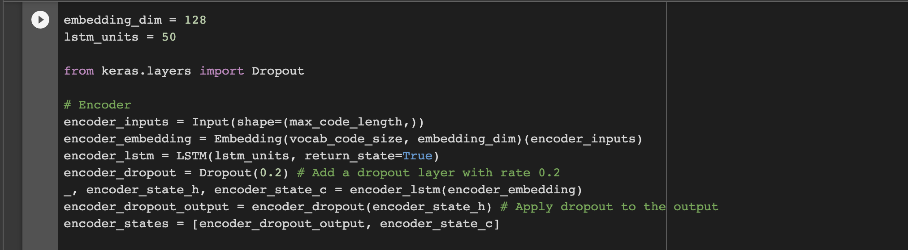
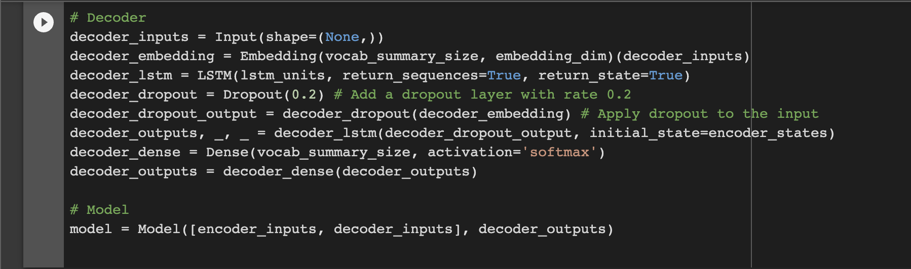
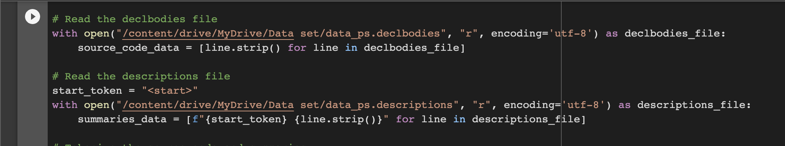
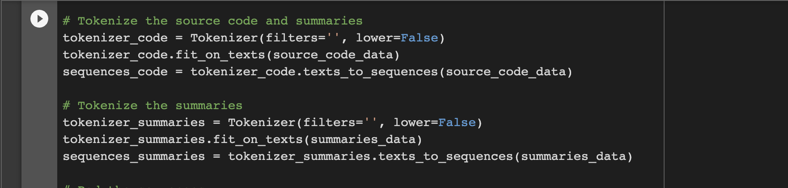
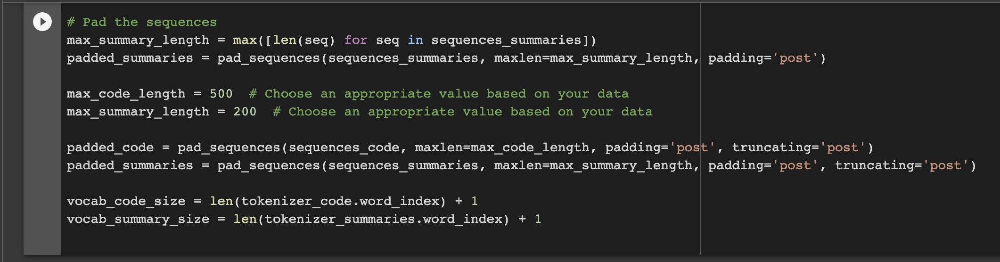
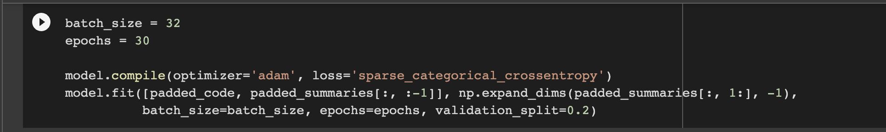

# Source Code Summarization using Seq2Seq LSTM


An MSc final project implementing an **encoder-decoder LSTM model** that automatically generates natural language summaries for Python source code functions.

## Overview

Reading and understanding code is one of the most time-consuming parts of software development. This project explores using deep learning — specifically a sequence-to-sequence (Seq2Seq) architecture — to automate the generation of concise natural language descriptions from raw source code.

Given a Python function body, the model produces a short textual summary describing what the function does. This has direct applications in code review automation, developer tooling, and AI-assisted documentation generation.

**Example:**
```
Input:  def disk_partitions(all=False):
            result = [dict(partition._asdict()) for partition in psutil.disk_partitions(all)]
            return result

Output: "returns a list of disk partitions"
```

## Architecture

The model follows a classic encoder-decoder (Seq2Seq) design:

### Full Model (Training)

| Component | Details |
|-----------|---------|
| Encoder | Embedding (128-dim) → LSTM (50 units) → Dropout (0.2) |
| Decoder | Embedding (128-dim) → Dropout (0.2) → LSTM (50 units) → Dense (softmax) |
| Optimizer | Adam |
| Loss | Sparse Categorical Cross-Entropy |
| Epochs | 30 |
| Batch Size | 32 |

### Encoder



The encoder reads the tokenized source code sequence and compresses it into a fixed-size context vector (hidden and cell states).

### Decoder



The decoder generates the summary token-by-token, conditioned on the encoder's context vector.

### Pre-processing Pipeline





### Training



### Inference

At inference time, the model is split into separate encoder and decoder models:

**Encoder Inference Model**


**Decoder Inference Model**


## Dataset

The model is trained on the **CodeSearchNet** Python dataset (`data_ps`), a large-scale dataset of Python functions paired with their docstring descriptions.

- **Source:** [CodeSearchNet](https://github.com/github/CodeSearchNet)
- `data_ps.declbodies` — tokenized Python function bodies
- `data_ps.descriptions` — corresponding natural language descriptions

> The dataset files are not included in this repository due to size. Download them from the CodeSearchNet repository and place them in the `data/` directory before training.

## Notebooks

| Notebook | Description |
|----------|-------------|
| [source_code_summarization_code_1_submission.ipynb](notebooks/source_code_summarization_code_1_submission.ipynb) | Initial model — data loading, tokenization, Seq2Seq model definition, training, and inference |
| [source_code_summarization_code_1_submission_2.ipynb](notebooks/source_code_summarization_code_1_submission_2.ipynb) | Refined model with full Google Colab Drive integration and improved data paths |
| [test_model.ipynb](notebooks/test_model.ipynb) | Model evaluation notebook |
| [testable_model_for_demo1.ipynb](notebooks/testable_model_for_demo1.ipynb) | Loads a saved model and tokenizers to run inference on custom source code inputs |

## Results

Training over 30 epochs on the full dataset:

| Epoch | Train Loss | Val Loss |
|-------|-----------|----------|
| 1     | 1.9516    | 1.3352   |
| 10    | 0.9048    | 1.1094   |
| 20    | 0.7556    | 1.1128   |
| 30    | 0.6823    | 1.1275   |

The model converges well on training loss. Validation loss plateaus around epoch 12–13, indicating the model begins to overfit slightly beyond that point.

## Setup

The notebooks are designed to run on **Google Colab** with the dataset mounted from Google Drive.

### Dependencies

```
tensorflow >= 2.x
keras
numpy
pickle
```

### Running Inference

1. Open `testable_model_for_demo1.ipynb` in Google Colab
2. Mount your Google Drive and place the saved model (`trained_model.h5`) and tokenizers (`tokenizer_code.pickle`, `tokenizer_summaries.pickle`) in your Drive
3. Update the file paths in the notebook
4. Run all cells and provide your source code string as input

## Project Structure

```
source-code-summarization/
├── notebooks/
│   ├── source_code_summarization_code_1_submission.ipynb
│   ├── source_code_summarization_code_1_submission_2.ipynb
│   ├── test_model.ipynb
│   └── testable_model_for_demo1.ipynb
├── images/
│   ├── Encoder.png
│   ├── Decoder.png
│   ├── Encoder Inference Model.png
│   ├── Decoder Inference Model.png
│   ├── Pre-processing1.png
│   ├── Pre-processing2.png
│   ├── Pre-processing3.png
│   ├── Training.png
│   └── fig1.png
└── README.md
```

## References

- Iyer et al. (2016) — *Summarizing Source Code using a Neural Attention Model*
- Hu et al. (2018) — *Deep Code Comment Generation*
- Sutskever et al. (2014) — *Sequence to Sequence Learning with Neural Networks*
- [CodeSearchNet Challenge](https://github.com/github/CodeSearchNet)
